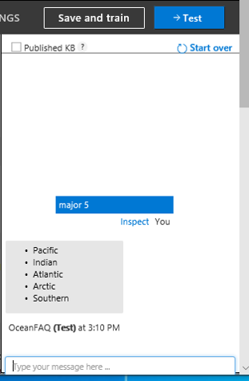

# **Lab - Build an FAQ chatbot with QnA Maker and Azure Bot Service**

**Create a QnA knowledge base**

Let&#39;s create a QnA Maker knowledge base (KB).

1. Go to the [QnA Maker portal](https://www.qnamaker.ai/?).  ([ai](https://qnamaker.ai/))
2. Select **Sign in** in the upper-right corner and sign in with your Azure credentials.

 
Unless you already have a knowledge base (KB), the portal will point out that you don&#39;t have any.

## **Creating a knowledge base and QnA Service**

1. In the menu at the top of the portal, select **Create a knowledge base**.

1. Select **Create a QnA service**. Selecting this button takes you to the Azure portal and signs you in with the credentials you used earlier. You will create the QnA Maker service and the associated Azure app service that will host it in this portal.

1. The Azure portal opens with the &quot;Web app bot&quot; configuration in a different tab. If any free recommendation advertisement opens – close that window by clicking on x. (shown below)

## **Provide the QnA Maker service details**

Provide these details to create the QnA Maker service:

  1. Enter a globally unique name for your QnA Maker service, such as _yourname-qna_. (e.g. student200-qna) Make a note of this name as you&#39;ll be using it later.
  2. Select your Azure subscription. (Visual Studio Enterprise Subscription or  Azure Subscription 1)
  3. Select the **S0** pricing tier for the service.

1. d)Select a location for the service, which should be the same region as the bot service, and near your physical location.
2. e)Select the resource group from the drop down. (e.g. student200)
3. f)Select **B (15 Indexes)**, the free tier, for the search pricing

1. g)For the search location, select the location **East US**.
2. h)Verify that the app name is unique. (If it is, it will be marked with a green check mark.) (e.g. student200)

1. i)Select the location for the website, which should match the location you used earlier. Select **East US**
2. j)You won&#39;t be using Application Insights for this test, so **disable**** App insights**.

1. k)Select **Create**. (at the bottom of the page)

1. l)After a brief deployment process, your resource will be created for the service.

1. m)Wait till your deployment is complete

## **Connect the QnA Maker service to the knowledge base**

1. Return to the QnA Maker web portal tab  ( [ai](https://qnamaker.ai/)) and refresh the page.

2. On the QnA Maker portal, select **Create a knowledge base** from the top menu.

3. The entries under (shown in the pic below) won&#39;t be filled in, but a link to the account information will be populated.

4. Select your Azure Directory ID, subscription name, and the name of the new QnA service you created earlier in the portal. (e.g. student200)

5.   Give your knowledge base a name under STEP 3. We&#39;ll use the Ocean FAQ, so you can name it OceanFAQ.

## **Populate the knowledge base**

We need some data for our KB. We&#39;ll use an existing FAQ as a sample

1. Add a sample word document as a URL:

[http://www.faqkids.com/ocean](http://www.faqkids.com/ocean)

1. Select + Add URL.

1. Once you click on + Add URL, URL will be added as shown below.

1. Add _ **Enthusiastic** _ **Chit-chat** to your KB.
2. Select **Create your KB**.

The extraction process takes a few minutes to read the document and identify questions and answers.

After QnA Maker successfully creates the knowledge base, the **Knowledge base** page opens. You can edit the contents of the knowledge base on this page.

After a short time, your KB will be created, and the Edit page will load.

## **Add a new question and answer set**

1. In the QnA Maker portal, on the **Edit** page, select **+ Add QnA pair** from the context toolbar.

1. Add the following **question** :

What are the 5 major oceans?

1. Add the **answer** formatted with _markdown_:

\* Pacific \n\* Indian \n\* Atlantic \n\* Arctic \n\* Southern

Just for your knowledge: The markdown symbol, \*, is used for bullet points. The \n is used for a new line.

Just for your knowledge: The **Edit** page shows the markdown. When you use the **Test** panel later, you will see the markdown displayed properly as shown below.

- Pacific
- Indian
- Atlantic
- Arctic
- Southern

## **Save and train**

In the upper right, select **Save and train** to save your edits and train the QnA Maker model. Edits aren&#39;t kept unless they&#39;re saved.

## **Test your knowledge base**

1. To get an idea of how a bot might respond to questions, select **Test** in the upper-right corner.

1. A test panel opens, ready for a question.
2. Enter **Hello** and select the Enter key. QnA will respond with &quot;Hello.&quot; Or &quot;Hi&quot;.
3. Enter **How are you?** and select Enter. QnA will respond with a message.
4. Enter **Major oceans.** QnA will respond with a list of oceans.

- Pacific
- Indian
- Atlantic
- Arctic
- Southern

1. You can continue to test the interaction by asking questions and evaluating the responses to get an idea of how the QnA KB is polled for answers.
2. Select Test again to close the Test panel.
3. Optional: Be creative when testing the process. Input other editorial pairs. You can even add alternate phrasing by clicking on the three dots in one of the input boxes and adding content.
4. After you have played with this for a while, select Save and Retrain to update the model.
5. Don&#39;t worry, you can always go back and make adjustments by deleting or adding new pairs.
6. Remember this is AI, always ready for updates.

 

**Publish a knowledge base**

Now that you&#39;ve created a QnA knowledge base, it&#39;s time to publish it so you can access it from a client application.

1. On the QnA Maker Knowledge base page, where you were testing in the previous exercise, select **PUBLISH** in the menu at the top of the page.

1. Read the message on the next page. It indicates that your KB will move from test to production. It also points out that your KB will be available as an endpoint that you can use in apps and bots.
2. Select **Publish**.
3. After a short time, a success message will appear (if no errors occur).
4. Note the URL information that appears. You can use the information provided to test the KB with Postman or curl.
5. Copy and paste the Postman code(shown below) on notepad app on your desktop – name it &quot;BotPostman&quot;.

1. Close notepad app

Optional: If you need to, you can select **Edit Service** to go back to the KB and make edits.

**Integrate QnA with a bot**

Now that you&#39;ve created and published your QnA knowledge base, it&#39;s time to learn how to integrate it with a bot. In this exercise, you&#39;ll create a chatbot on the Azure to integrate with the QnA Maker knowledge base you created earlier.

1. In the QnA Maker portal, go to the Publish page, and publish your knowledge base, if it is not already published.
2. Select Create Bot.

1. The Azure portal opens with the &quot;Web app bot&quot; configuration in a different tab. If any free recommendation advertisement opens – close that window by clicking on x. (shown below)

1. You should see the following screen, which is the Azure Portal.

1. Enter the settings to create the bot: (Most of the options will auto-populate)

1.
  1. Give your bot an appropriate name – (Auto populated - e.g. student200-bot)
  2. Choose the Subscription service you have been using for this course – (Auto populated - Visual Studio Enterprise Subscription)
  3. Select the proper Resource Group (Auto populated – e.g. student200)
  4. Choose the location for the bot. Remember that it&#39;s best to use the same location as your other services (East US)
  5. Select **$1 (1K Premium Msgs/Unit)** pricing tier
  6. The app name should auto-populate (Auto populated - e.g. student200-bot)
  7. Choose **C#** as the SDK language
  8. Leave the remaining fields at their default.
  9. Turn the Application Insights Off

…………………………..Picture32..better pic

j. Click **Create**. In a few minutes, your bot should be created. (Sample Screen below)

## **Chat with the Bot**

1. Click on the bell shared icon on the upper right-hand corner – you will see the notifications. When the deployment is complete, you will see the following screen.

1. In the Azure portal, open the new bot resource from the notification. You can click on &quot;Go to resources&quot;

1. Under **Bot Management** , select **Test in Web Chat**.

At the chat prompt of **Type your message** , enter: Major ocrans

1. The chat bot responds with an answer from your knowledge base.
2. Notice the spelling mistake in oceans, your bot is smart enough to understand that.
3. Did you notice you did not have to type the entire question?

1. Under **Bot Management** , select **Channels**.
2. Click on Edit in Webchat

1. Click on &quot;Show&quot; under Secret Keys

1. Copy **Embed code** in a separate notepad.

1. In the notepad where you have pasted the Embed code. Replace the wording &quot;YOUR\_SECRET\_HERE&quot; the first Secret Key. (make sure to include the single quote as shown below)

1. Save the notepad File name: mybot.htm in your desktop. Save as type: All Files

1. Double click on the saved file and it will open in the browser. This is your ChatBot,

1. At the chat prompt of **Type your message.** The chat bot responds with an answer from your knowledge base.
2. You can go back to your **Knowledge Base** in [ai](https://qnamaker.ai/) portal,  and add more questions.
3. Go to My Knowledge base, select **OceanFAQ**

